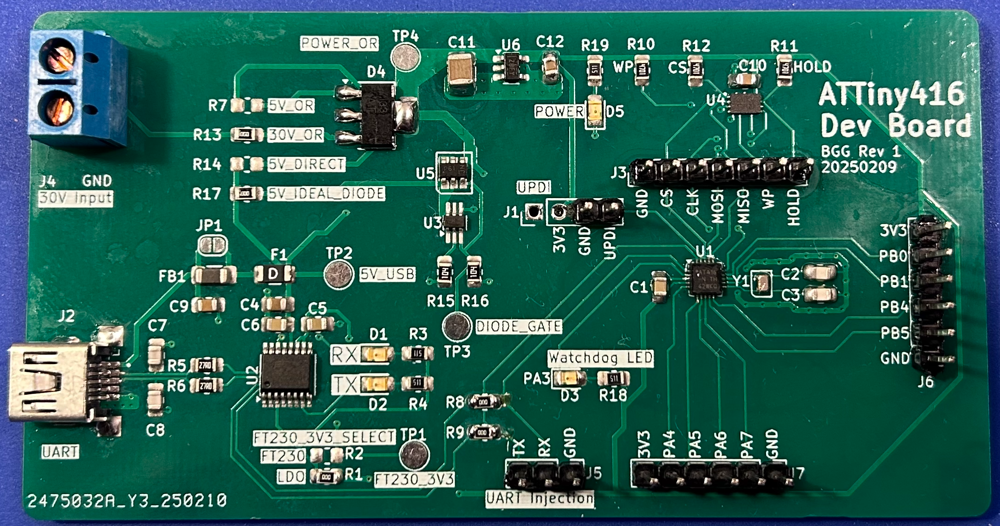
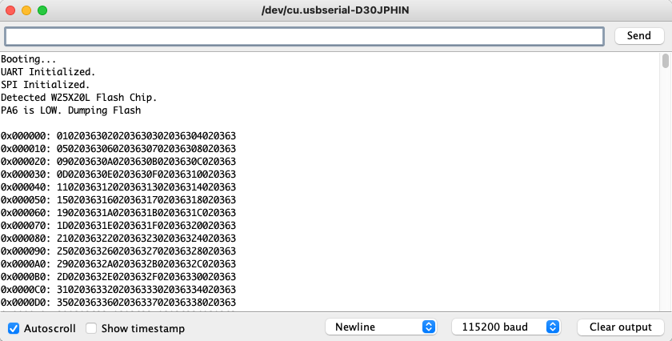

# ATTiny416 Sensor Board

This project is my first attempt at embedded hardware/software design where I layout/route a custom PCB. In my professional career, I have done schematic capture, integrated Arduino and Raspberry Pi like development boards into custom solutions, and developed embedded software, but this will be my first time laying out a custom circuit card.

There were no real requirements for this design as the primary objective was to learn how to layout a PCB using KiCad. However, to make the design process a little more interesting than just a custom “Arduino”, I decided I wanted my board to have the following features:
-	UART communication to/from the microcontroller 
-	3.3V microcontroller (instead of 5V)
-	Includes SPI flash for recording data
-	Accepts/regulates power from multiple inputs:
    - 5 V from USB
    - 30V from an external power source
 
The following image is the of the final board. The sections that follow will describe the more interesting portions of the design.

## Relevent Repository Links:

- [KiCad Schematics](KiCad/): Contains the KiCad schematics for the electrical design
    -  [Schematic Plots](KiCad/Plots/): Contains the PDF schematics plots for the electrical design
- [SPICE files](SPICE): Contains the LTSpice models used in the design
- [Code](Code): Contains the test code developed for the design

## Hardware Design

The first step in hardware design was selecting a microcontroller. I chose the ATTiny416 because of its interesting formfactor. It comes in a very small (3x3mm) VQFN package while still providing a lot of the common/core Atmel peripherals found on larger microcontrollers. This microcontroller also supports multiple logic levels, including 3.3V. The ATTiny416 is also very easy to integrate into a design as it requires almost no supporting peripheral hardware. 

I purchased an [ATTiny416 XPLAINED NANO](https://www.microchip.com/en-us/development-tool/attiny416-xnano) development board to support initial software development while I was waiting for my PCB to be manufactured. I would also modify this board later to act as an external programmer for the ATTiny416 on my custom circuit card. 

### Power OR Spice Modeling

### PCB Design, Layout, and Manufacture

 
## Software Design

### Software Testing Results

## Uncompleted Work

The following still needs to be completed on this project:
- Test the external 32kHz crystal oscilator
