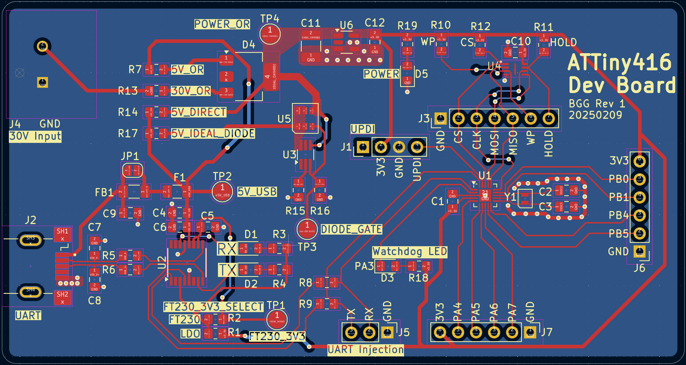

# ATTiny416 Sensor Board

This project is my first attempt at embedded hardware/software design where I layout/route a custom PCB. In my professional career, I have done schematic capture, integrated Arduino and Raspberry Pi like development boards into custom solutions, and developed embedded software, but this will be my first time laying out a custom circuit card.

There were no real requirements for this design as the primary objective was to learn how to layout a PCB using KiCad. However, to make the design process a little more interesting, I decided I wanted the board to have the following features:
-	USB to UART communication to/from the microcontroller 
-	3.3V microcontroller (instead of 5V)
-	Includes SPI flash for recording data
-	Accepts/regulates power from multiple inputs:
    - 5 V from USB
    - 30V from an external power source
 
The following image is the of the final board. The sections that follow will describe the more interesting portions of the design.

## Relevent Repository Links:

- [KiCad Schematics](KiCad/): Contains the KiCad schematics for the electrical design
    -  [Schematic Plots](KiCad/Plots/): Contains the PDF schematics plots for the electrical design
- [SPICE files](SPICE): Contains the LTSpice models used in the design
- [Code](Code): Contains the test code developed for the design

## Hardware Design

The first step in this hardware design was selecting a microcontroller. I chose the ATTiny416 because of its interesting formfactor. It comes in a very small (3x3mm) VQFN package while still providing a lot of the common/core Atmel peripherals found on larger microcontrollers. The USART and SPI peripheral were used in this projet. This microcontroller also supports multiple logic levels, including 3.3V. The ATTiny416 is also very easy to integrate into a design as it requires almost no supporting external hardware. 

I purchased an [ATTiny416 XPLAINED NANO](https://www.microchip.com/en-us/development-tool/attiny416-xnano) development board to support initial software development while I was waiting for my PCB to be manufactured/delivered. I would also modify this board later to act as an external programmer for the ATTiny416 on my custom circuit card. 

### Power 

### USB to UART

The FT230 was selected to provide the USB to UART interface. This FTDI chip was chosen primarily for it's price. 
The FT230 datasheet recommended input USB data line filtering capacitors and termination resistors which were added to the design. LEDs were also added to CBUS1/2 on FT230 to serve as Tx/Rx indicators.

The FT230 uses 5V logic levels on the USB inputs to comply with USB standards, but the UART output logic levels are configurable from 1.8-3.3V via the VCCIO input. The FT230 includes an internal 3.3V LDO on the 3V3OUT pin that can be connected directly to the VCCIO pin to provide the required 3.3V output logic levels. However, it is possible that the FT230's 3.3V regulator is outputting a higher voltage that the circuit card's main TPS7B6933DBVR LDO. Therfore, the output of the design's main 3.3V LDO (TPS7B6933DBVR) was connected to the FT230's VCCIO input, instead of connecting the FT230's 3V3OUT.

Jumper resistors were included between the ATTiny416 and FT230 to support isolating the components if needed for debugging. Jumper resistors were also added to allow the FT230's 3V3OUT to be connected to VCCIO instead of TPS7B6933DBVR if needed.

## SPI Flash

### PCB Design, Layout, and Manufacture

 
## Software Design

### Software Testing Results

## Uncompleted Work

The following still needs to be completed on this project:
- Test the external 32kHz crystal oscilator
