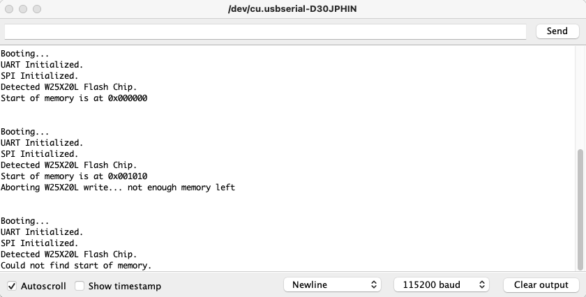
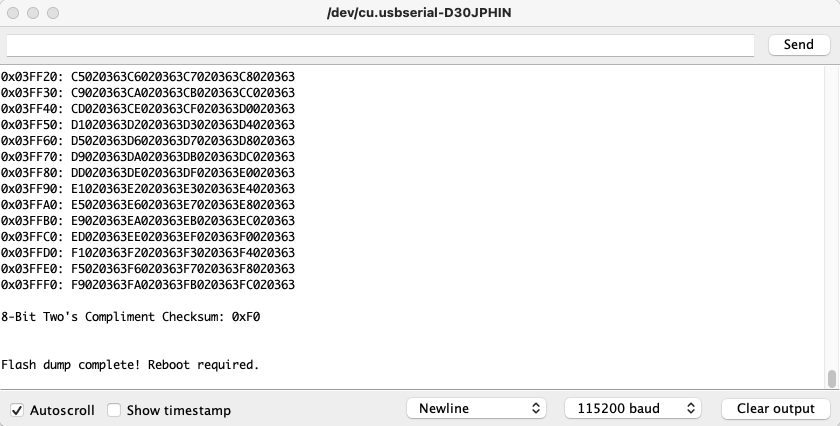

# ATTiny416 Sensor Board

This project is my first attempt at embedded hardware/software design where I layout/route a custom PCB. In my professional career, I have done schematic capture, integrated Arduino and Raspberry Pi like development boards into custom solutions, and developed embedded software, but this will be my first time laying out a custom circuit card.

There were no real requirements for this design as the primary objective was to learn how to layout a PCB using KiCad. However, to make the design process a little more interesting, I decided I wanted the board to have the following features:
-	USB to UART communication to/from the microcontroller 
-	3.3V microcontroller (instead of 5V)
-	Includes SPI flash for recording data
-	Accepts/regulates power from multiple inputs:
    - 5 V from USB
    - 30V from an external power source
 
The following image is the of the final board. The sections that follow will describe the more interesting portions of the design.

## Relevent Repository Links:

- [KiCad Schematics](KiCad/): Contains the KiCad schematics for the electrical design
    -  [Schematic Plots](KiCad/Plots/): Contains the PDF schematics plots for the electrical design
- [SPICE files](SPICE): Contains the LTSpice models used in the design
- [Code](Code): Contains the test code developed for the design

## Hardware Design

The first step in this hardware design was selecting a microcontroller. I chose the ATTiny416 because of its interesting formfactor. It comes in a very small (3x3mm) VQFN package while still providing a lot of the common/core Atmel peripherals found on larger microcontrollers. The USART and SPI peripheral were used in this project. This microcontroller also supports multiple logic levels, including 3.3V. The ATTiny416 is also very easy to integrate into a design as it requires almost no supporting external hardware. 

I purchased an [ATTiny416 XPLAINED NANO](https://www.microchip.com/en-us/development-tool/attiny416-xnano) development board to support initial software development while I was waiting for my PCB to be manufactured/delivered. I would also modify this board later to act as an external programmer for the ATTiny416 on my custom circuit card. 

### Power 

The power design needed to provide the following features:
- Accept 5V USB input power
- Accept up to 30V of external input power
- Accept any compination of power inputs being present at the same time
- Preclude the backfeeding of power from input to input
- Provide a minimum of 50mA @ 3.3V whenver at least one input power is present
    - Provide uninterrupted power when transitioning from multiple input power sources to a single input power source
- Function at ambient temperature
 
The TPS7B6933 LDO linear regulator was selected to generate the 3.3V rail as the microcontroller, SPI flash, and USB to USART preipherals are all relatively loww power devices and LDOs are among the simplest power supply designs to implement.
The TPS7B6933 can accept up to 40V (45V transient) of input voltage. The LDO is rated to provide 150mA of output current with a 14V input power source, therfore the maximum output current at 30V can be approximated to ~75mA, meeting the 50 mA requirement.

The simplest way to OR multiple power sources while precluding backfeeding of power would be a diode OR. This was considered, but determine to not be feasbile. The dropout voltage on the TPS7B6933 is 800mV, meaning 4.1V is the minimum input voltage required to maintain the 3.3V output (3.3V + 0.8V = 4.1V). Most diodes will have a forward voltage drop of aproximatly 0.7V. According to the USB spec, the minimum USB voltage available at peripherals is 4.35V. Therfore, after this 4.35V input USB power went through the diode, the voltage at the input to the LDO would be 3.65V (4.35V - 0.7V = 3.65V), which is below the TPS7B6933's minimum input voltage of 4.1V. 

Therfore, an ideal diode circuit was designed to provide a smaller voltage drop when switching in the 5V USB input, while a regular diode was used to switch in the 30V input.
The DZDH0401DW P-Channel ideal diode controller was chosen primarly becuase of cost. An N-Channel ideal diode controller would have provided an even smaller voltage drop, but the design did not require this.
The DMP6110SVT was selected as the P-Channel FET primarily for it's relatively low R_DS(on) for a P-Channel FET of 130 mOhm. This R_DS(on) corresponds to a maximum voltage drop of 0.0065V accross the FET at the maximum required 50mA output current (0.050A * .130mOhm = 0.0065V). This results in a minimum LDO input voltage of ~4.34VDC when only 5V USB power is present, well above the 4.1V minimum required by the TPS7B6933. 

The BAT160 was selected as the diode to swith the 30V input. A LTSpice model was created to tune the ideal diode controler's resistors and to verify circuit functionality before manufacturing. The two images that follow are of the SPICE model where both 5V (4.35V) USB and 30V input power are switched while the 3.3V output is measured.

The colors in the time-base results that follow correspond to the following measurement points:
- Green: 30V input power
- Red: 5V (4.35V) USB input power
- Blue: ORed power from the BAT160 and DZDH0401DW ideal diode circuit
- Pink: 3.3V output power

Jumper resistors were also included in the design to allow the power diode to be reconfigured or bypassed entirely.

### USB to UART

The FT230 was selected to provide the USB to UART interface. This FTDI chip was chosen primarily for it's price. 
The FT230 datasheet recommended input USB data line filtering capacitors and termination resistors which were added to the design. LEDs were also added to CBUS1/2 on the FT230 to serve as Tx/Rx indicators.

The FT230 uses 5V logic levels on the USB inputs to comply with USB standards, but the UART output logic levels are configurable from 1.8-3.3V via the VCCIO input. The FT230 includes an internal 3.3V LDO on the 3V3OUT pin that can be connected directly to the VCCIO pin to provide the required 3.3V output logic levels. However, it is possible that the FT230's 3.3V regulator is outputting a higher voltage that the circuit card's main TPS7B6933 LDO. Therfore, the output of the design's main 3.3V LDO (TPS7B6933) was connected to the FT230's VCCIO input, instead of connecting the FT230's 3V3OUT.

Jumper resistors were included between the ATTiny416 and FT230 to support isolating the components if needed for debugging. Jumper resistors were also added to allow the FT230's 3V3OUT to be connected to VCCIO instead of TPS7B6933 if needed.

The 5V USB power that is accepted on the mini-B USB input is also fused before being utilized/regulated. 

### SPI Flash

### PCB Design, Layout, and Manufacture

 
## Software Design

### Software Testing Results

## Uncompleted Work

The following still needs to be completed on this project:
- Test the external 32kHz crystal oscilator
- Add overcurrent protection to 30V input
